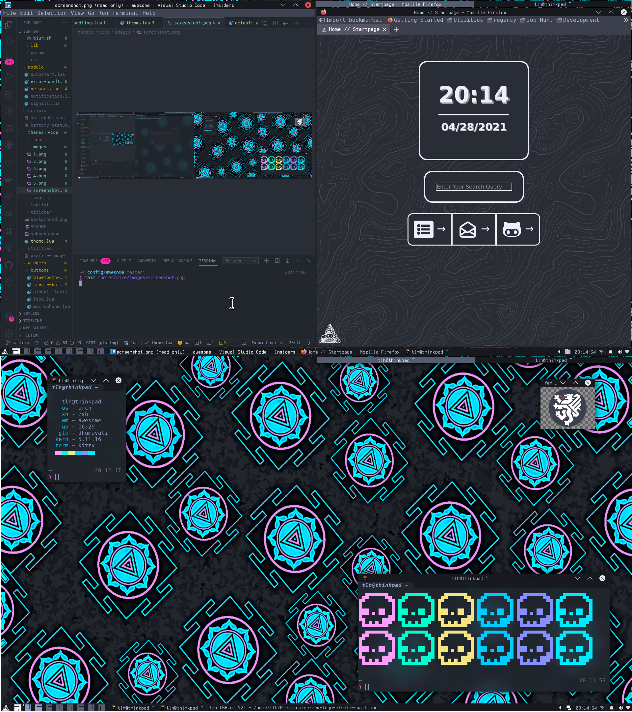

<div align="center" id="top"> 
  

  &#xa0;

</div>
<h1>DON'T GET ATTAHED, HUGE REWRITE IN THE WORKS</h1>
I know, I seem to have been rewriting this config weekly for a few months, but that's because I am close, so close (thanks to a Tom Meyers of TOS, awesome project, horrible logo/mascot he uses though...so horrible) to a functional, glorious dotfiles-like (remember I said functional) and fully featured desktop userland for the Electric Tantra Linux, so this particular configuration only has until then until it will be scrapped in favor of the configuration on going location [here](https://github.com/the-Electric-Tantra-Linux/awesomwm).From the linked repo, you can watch as I slowly work out all the kinks of the system and get that set up but this one is here for convenience in case you (or I tbh) need a working, not obnoxious configuration to hold you over. This process could end tonight, or in two months as with lua its always up in the air. 
<h1 align="center">Awesome</h1>


<p align="center">
  

  

  

  

  <!--  -->

  <!--  -->

  <!--  -->
</p>


<hr> 

<p align="center">
  <a href="#dart-about">About</a> &#xa0; | &#xa0; 
  <a href="#sparkles-features">Features</a> &#xa0; | &#xa0;
  <a href="#rocket-technologies">Technologies</a> &#xa0; | &#xa0;
  <a href="#white_check_mark-requirements">Requirements</a> &#xa0; | &#xa0;
  <a href="#checkered_flag-starting">Starting</a> &#xa0; | &#xa0;
  <a href="#memo-license">License</a> &#xa0; | &#xa0;
  <a href="https://github.com/Thomashighbaugh" target="_blank">Author</a>
</p>

<br>

## 0.1. :dart: About ##

Heavily inspired by [awesome-shell](https://github.com/Mofiqul/awesome-shell) by [Mofiqul](https://github.com/Mofiqul) 


## 0.2. :sparkles: Features ##

:heavy_check_mark: Feature 1; Mouse or Keyboard driven
:heavy_check_mark: Feature 2; Easily Launch Applications with quick keypresses
:heavy_check_mark: Feature 3; Custom base16 color scheme (called vice)
:heavy_check_mark: Feature 4; Personal and custom backgrounds and graphics
:heavy_check_mark: Feature 5; Included external libraries for faster, more consistent loading without additional fuss. 
:heavy_check_mark: Feature 6; No unnecessary bloat, no obnoxious hardware queries causing your CPU to meltdown, no


## 0.3. :rocket: Technologies ##

The following tools were used in this project:

- [Awesomewm](https://awesomewm.org/)
- [Lua](https://luarocks.org/)
- [Patience](https://en.wikipedia.org/wiki/Shiva)
- [UnixPorn](https://www.reddit.com/r/unixporn/)

## 0.4. :white_check_mark: Requirements ##

This project requires you to have the variant of AwesomeWM built from the development branch, which if you have an Arch-based system and yay installed is acquired with the following command, which includes other necessary programs for running the setup:

```bash
yay -S awesome-git 
``` 
All of which is included in my [dotfiles installation script](https://github.com/Thomashighbaugh/dotfiles)


Users of other distros will have to build from the source (sorry), follow the instructions on Awesome's README page for detailed instructions 


**Coming Soon** You can preview this whole set up without needing to mess around with installing 
## 0.5. :checkered_flag: Installing This Configuration ##

#### Method One 
```bash
# Clone this project
$ git clone https://github.com/Thomashighbaugh/awesomewm $HOME/.config/awesome

# If Running Awesome 
$ awesome --restart

# Otherwise Restart your Display Manager OR Reboot and Login in Selecting Awesome As Your Session
$ systemctl restart lightdm 
# or 
$ sudo reboot 

```

#### Method Two
This is the more full flavored variant, in which you will select AwesomeWM from my dotfiles installation script. 
```bash
$ git clone https://github.com/Thomashighbaugh/dotfiles $HOME/dotfiles 

$ cd $HOME/dotfiles 

$ ./INSTALL 

# No You Will Need to Go Through the Process, At Least by Running the First Menu Item then GUI and select Awesome
# This will take care of downloading and provisioning this repo and all the accessories that go along with it, exactly as I do on my own systems. 

```
## 0.6. :memo: License ##

This project is under license from MIT. For more details, see the [LICENSE](LICENSE.md) file.


A Project By <a href="https://github.com/Thomashighbaugh" target="_blank">Thomas Leon Highbaugh</a>


<a href="#top">Back to top</a>
